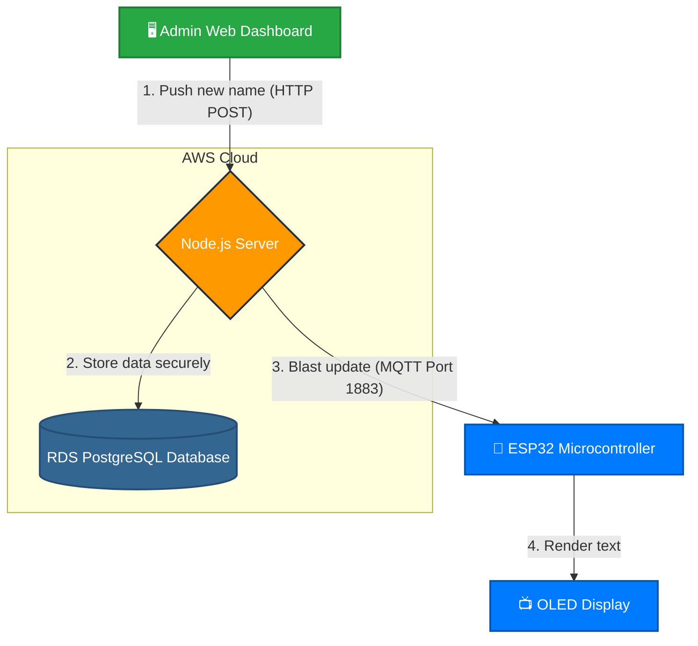

# DigiPlay - IoT Digital Name Display Platform

Welcome to **DigiPlay**! This is a complete, cloud-native IoT solution designed for remotely managing and updating digital name displays (using ESP32 microcontrollers and OLED screens). 

## 🌟 What is DigiPlay?
DigiPlay allows an administrator to instantly push text updates to dozens of hardware displays over the internet using a secure Web Dashboard.
Whether you are deploying 1 display or 1,000 displays across a campus, DigiPlay provides a secure, instantaneous way to update them all from a centralized Web Dashboard.

## 🌟 Key Features
- **Centralized Admin Dashboard:** Manage content and monitor hardware status (Online/Offline) in real-time.
- **Embedded MQTT Broker:** Uses the high-performance **Aedes** engine for instantaneous, sub-second message delivery to hardware.
- **Bi-directional Communication:** Hardware status is tracked via MQTT presence, while content is pushed securely via Pub/Sub.
- **Cloud-Native Design:** Built from the ground up to be deployed on AWS (EC2, RDS PostgreSQL, Secrets Manager).

---

## 🏗️ System Architecture



## 📂 Project Structure
This repository contains exactly what you need to deploy the full system. Please refer to the specific documentation in each folder:

1. **[digiplay_firmware/NEW_FIRMWARE_GUIDE.md](digiplay_firmware/NEW_FIRMWARE_GUIDE.md)**: The C++ Arduino code that goes onto the physical ESP32 microcontrollers.
2. **[server/NEW_SERVER_GUIDE.md](server/NEW_SERVER_GUIDE.md)**: The Node.js backend server that hosts the admin dashboard and the embedded MQTT broker.
3. **[NEW_cloud_setup.md](NEW_cloud_setup.md)**: A step-by-step beginner's guide to deploying the server infrastructure on Amazon Web Services (AWS).

## 🚀 How it Works (The Flow)
1. You plug in an ESP32 device. It connects to Wi-Fi and securely connects to the server's MQTT broker using highly secure, unique credentials.
2. The Admin logs into the Web Dashboard on their computer using session cookies.
3. The Admin clicks "Push Update" and types a new name.
4. The Node.js server updates the AWS RDS Database and instantly blasts the new name to the ESP32 via MQTT.
5. The ESP32 updates its OLED screen in less than a second!
---

## 🚀 Quick Start (Local Development)

If you want to run the system locally on your own computer before pushing it to AWS:

### 1. Start the Server
```bash
cd server
npm install
npm run seed       # Creates the default admin account
npm run dev        # Starts the development server
```
- **Web Dashboard:** Access it at `http://localhost:8000`
- **MQTT Broker:** Devices can connect to `mqtt://your-local-ip:1883`

### 2. Connect the Hardware
1. Open `digiplay_firmware/espcode.ino` in the Arduino IDE.
2. Update the `MQTT_BROKER` to your computer's local IP address.
3. Flash the code to your ESP32.
4. Watch the OLED screen update instantly when you type a new name in the Web Dashboard!

---
*DigiPlay — An IoT Project exploring secure real-time hardware management.*
