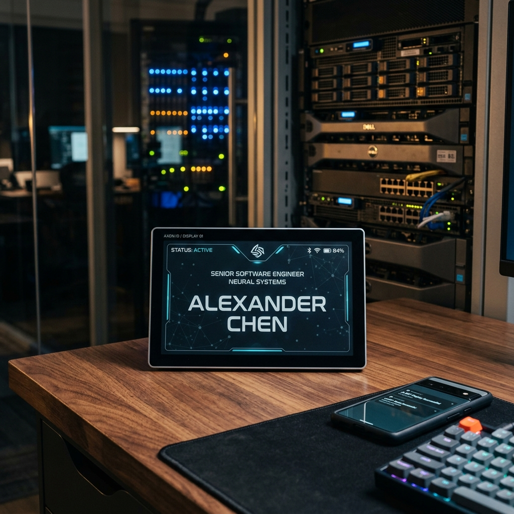
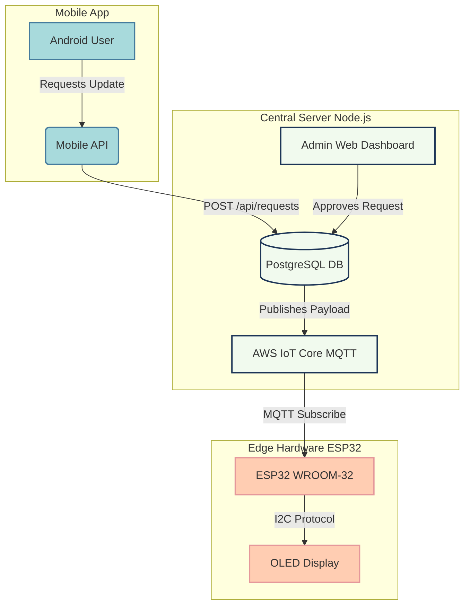

# 📟 DigiPlay: Remote Digital Name Display System

**DigiPlay** is an integrated Internet of Things (IoT) platform designed to remotely manage and update digital name displays running on ESP32 microcontrollers. It provides a full-stack solution featuring a mobile app for requesting content changes, an admin web dashboard for approving requests, a real-time MQTT backend, and efficient edge firmware.

---

## 🌟 Key Features

- **Real-Time Display Updates**: Leverage AWS IoT Core MQTT for instantaneous synchronization of display content to remote edge devices globally.
- **Admin Approval Workflow**: Ensures complete control. Mobile users request content changes, but devices only update after an administrator explicitly approves the request via the web dashboard.
- **Enterprise-Ready Infrastructure**: Built natively for AWS, integrating EC2, RDS, Secrets Manager, and AWS IoT Core.
- **Bi-Directional Status Tracking**: The server inherently tracks the active `Online`/`Offline` presence of each hardware device in real-time.
- **Enterprise-Ready Infrastructure**: Includes configuration blueprints for deploying on AWS (Fargate, IoT Core, RDS, Secrets Manager).

---

## 🏗️ System Architecture

The ecosystem consists of three main components: a Mobile Application, a Cloud Server, and Edge Hardware (ESP32).

---

## 📂 Project Structure

| Component | Directory | Tech Stack | Description |
| :--- | :--- | :--- | :--- |
| **Backend Server** | `/server` | Node.js, Express, AWS SDK, Sequelize | Hosts the REST APIs, Admin HTML templates (Nunjucks), and pushes to AWS IoT. |
| **Mobile App** | `/DigiPlay_App` | Android (Java), OkHttp | Mobile interface for users to look up devices and request display content changes. |
| **Device Firmware** | `/digiplay_firmware` | C++ (Arduino IDE), PubSubClient | Secure firmware for the ESP32 connecting to AWS IoT Core via X.509 certs. |

---

## 🚀 Getting Started

### 1. Backend Server Setup
1. Navigate to `/server`.
2. Install dependencies: `npm install`
3. Configure your environment variables in `.env` (or use AWS Secrets Manager).
4. Run the setup scripts to seed the database and admin account.
5. Start the server: `npm run dev`

### 2. Hardware (ESP32) Setup
1. Open `/digiplay_firmware/digiplay_firmware.ino` in the Arduino IDE.
2. Hardcode your `WIFI_SSID` and `WIFI_PASS`.
3. Provide the `AWS_IOT_ENDPOINT` from your AWS Console.
4. Paste the 3 AWS Certificates (Root CA, Device Cert, Private Key) securely into the code using `\n" \` formatting.
5. Flash the firmware to your ESP32.

### 3. Mobile App Deployment
1. Open `/DigiPlay_App` in Android Studio.
2. Provide your API URL and keys in `local.properties`.
3. Build and install the APK on an Android device.

---

## ☁️ Cloud & AWS Deployment

DigiPlay is designed to scale. For production environments, refer to our detailed deployment documentation:
* [Cloud Setup Guide](./cloud_setup.md): Step-by-step instructions to configure networking, IAM, compute, and security on AWS.

---

> **Note**: DigiPlay enforces a strict "Approval-Only" policy. The edge display devices will only poll and apply content that has been verified and marked as `APPROVED` by a system administrator. Unapproved or pending requests remain isolated on the server.
