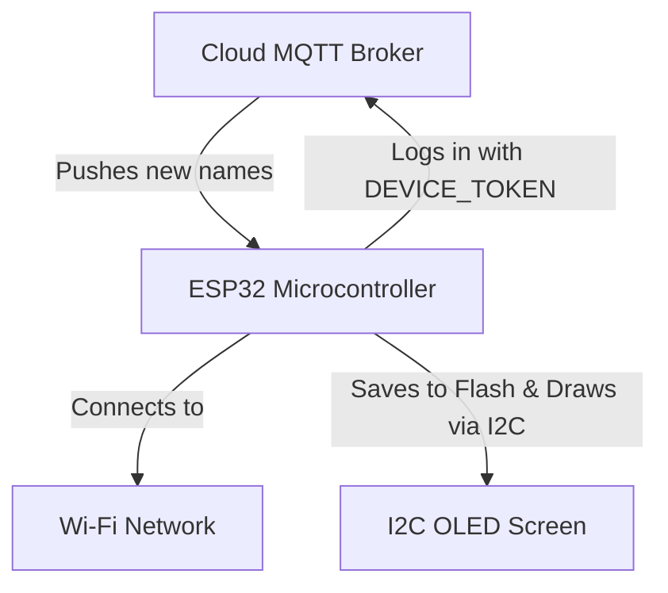

# DigiPlay ESP32 Firmware Guide

## ⚡ 1. Hardware & Architecture



### 1.1 Wiring the OLED
Connect a standard SSD1306 OLED display using the I2C protocol:
| OLED Pin |   ESP32 Pin   |
|----------|---------------|
| VCC      |     3.3V      |
| GND      |     GND       |
| **SCL**  |  **GPIO 22**  |
| **SDA**  |  **GPIO 23**  | 

*(Optional: You can wire an LED to GPIO 2 and a Reset Button to GPIO 0).*

---

## 🛠️ 2. Arduino IDE Setup & Flashing

### 2.1 Required Libraries
In the Arduino IDE, go to **Sketch → Include Library → Manage Libraries**, and install:
- `PubSubClient` (by Nick O'Leary)
- `ArduinoJson` (by Benoit Blanchon)
- `Adafruit SSD1306` & `Adafruit GFX`

### 2.2 Updating the Code Credentials
Before clicking upload, you must update the top of `espcode.ino` with your specific network and server details:
```cpp
const char* MQTT_BROKER = "YOUR_EC2_PUBLIC_IP"; 
const char* DEVICE_ID   = "DP001"; // Copy from Web Dashboard
const char* DEVICE_TOKEN = "xyz123"; // Copy from Web Dashboard
const char* WIFI_SSID   = "Your_WiFi_Name";
const char* WIFI_PASS   = "Your_WiFi_Password";
```

### 2.3 Build & Flash Settings
Ensure your Arduino IDE is set up with these board parameters before flashing:
- **Board:** ESP32 Dev Module
- **Upload Speed:** 921600
- **CPU Frequency:** 240MHz
- **Flash Mode:** QIO
- **Flash Size:** 4MB (32Mb)

---

## 💾 3. Core Logic Breakdown

Unlike older versions of DigiPlay, this firmware uses **MQTT exclusively** for real-time updates and completely removes HTTP polling to save power and increase speed.

1. **Flash Storage (Preferences)**: The ESP32 saves the latest approved text directly into its flash memory. If the device loses power and reboots, it will instantly display the last known name without waiting for the Wi-Fi to connect.
2. **Instant MQTT Updates**: The device stays permanently connected to the Aedes MQTT broker on port `1883`. When the server publishes a new name, the `mqttCallback()` function triggers in milliseconds.
3. **Checksum Validation**: Every MQTT message contains a checksum. If the server accidentally sends the exact same name twice, the ESP32 ignores it to prevent screen flicker and unnecessary flash memory writes.

---

## ⚠️ 4. Common Problems & Troubleshooting

- **"MQTT Connection Failed, rc=-4"**: This means the ESP32 cannot reach the server at all. Make sure your EC2 IP address is correct and Port `1883` is open in your AWS Security Groups inbound rules.
- **"MQTT Connection Failed, rc=5"**: This means your server rejected the login. Ensure your `DEVICE_ID` and `DEVICE_TOKEN` exactly match what you generated on the web dashboard!
- **OLED is blank**: Check your SDA/SCL wiring. Sometimes they are accidentally swapped. Also, ensure the I2C address in the code matches your physical hardware (usually `0x3C`).
- **Constant Rebooting**: Ensure your power supply (USB cable) provides enough current. The ESP32 requires up to 500mA during Wi-Fi transmission bursts.
